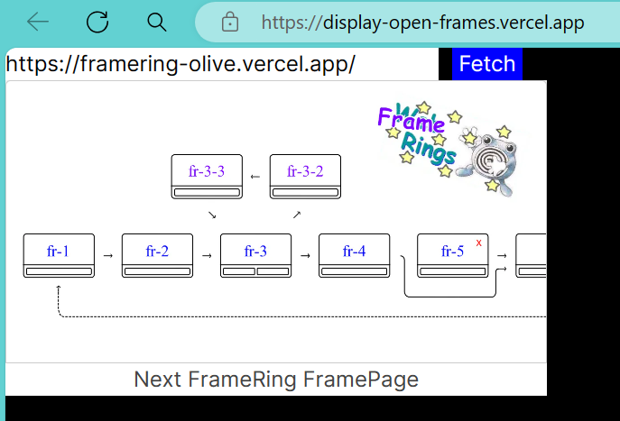

# Frame Ring

Just a good old fashioned web ring but with open frames ^-^

Instructions:

1. Fork this FrameRing repo and import it into a new Vercel Next.js project

2. Set your project domain to framering-#.vercel.app – where # is the your place in the ring.* 

3. Create a 1200x630px png to use as your frame image. Call it image.png and put it to the /public folder, overwriting the one that's in there.

4. Open the constants.ts file in the /constants folder and change the numbers in the paths to reflect your place in the ring.

5. Commit your changes, deploy, and that's it!

Have fun on the internet

-elle
